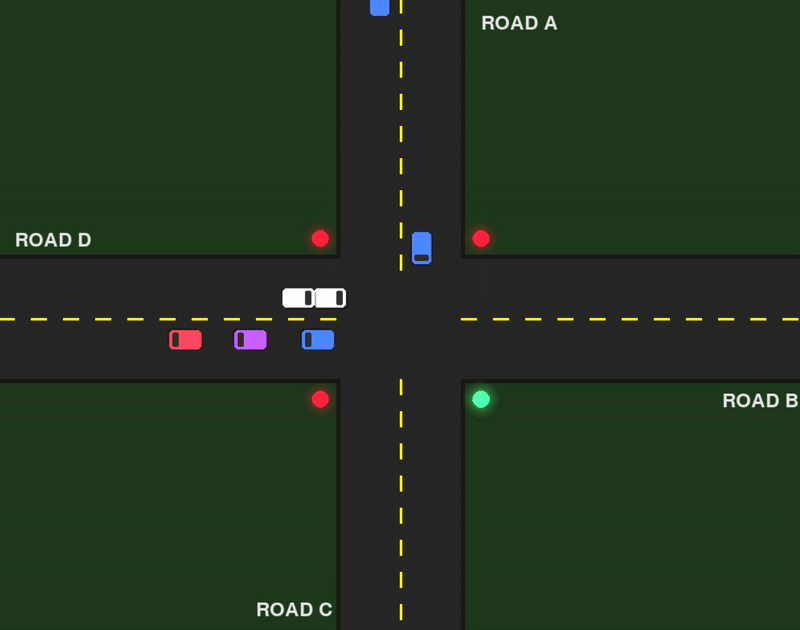

# Traffic Light Simulation and Queue Management System

## Title

**Name**: Parbat Baniya

**Class**: CS-I

**Roll number**: 7

**Assignment**: I

**Submitted to**: Rupak Ghimire

**Course**: Data Structures and Algorithms (COMP202)

## Introduction

This project simulates a smart 4-way traffic intersection designed for **Left-Hand Traffic** systems developed as an assignment for the course **Data Structures & Algorithms (COMP202)**. The core objective of this project is to demonstrate efficient **Queue Management** using a **Priority Queue** algorithm.

Unlike standard traffic lights that use a fixed-timer, this system implements a **dynamic priority logic** i.e. Hysteresis control. This system specifically monitors the North-bound lane (Road A, Lane 2). If traffic congestion in this priority lane exceeds a critical threshold (10 vehicles), the system overrides the standard traffic signal cycle to flush the queue of that lane, optimizing traffic flow.

## Demo Output



## System Architecture
The project is designed with a **Producer-Consumer** architecture using file I/O as the communication buffer.

- `traffic_generator.py` acts as the **Producer** that randomly generates vehicles arrivals based on probability. It then writes vehicle IDs that are timestamped into buffer files in the `lane_data/` directory.

- `visualizer.py` acts as the **Consumer** that reads buffer files in the `lane_data` directory to spawn vehicles in the GUI. It renders the intersection along with the vehicles using the `pygame` module. It also executes the traffic light state machine and physics engine.


## Features
- **Priority Logic**: This system monitors the lane L2 of road A. If the queue length for that lane exceeds 10 vehicles, it triggers a "Priority Mode" that sets and holds the green light for AL2 lane until the queue drops to 5 or fewer vehicles.
- **Left-Hand Traffic (LHT)**: Vehicles follow LHT rules, standard in Nepal and the UK.
- **Real-time Visualization**: `visualizer.py` is built with `pygame`, which features visual cues for traffic light along with glowing effects, moving vehicles, and lane markings.
- **Dynamic Traffic Generation**: A separate generator script `traffic_generator.py` simulates varying vehicle loads by writing data to file buffers in real-time.
- **Metrics Tracking**: `metrics.py` tracks total vehicles served overall along with vehicles served per lane.

## Installation & Prerequisites

This project requires **Python 3.x** to run as intended. So, ensure you have **Python 3.x** installed.

You can check your installed Python version by typing the command `python --version` in the terminal.

1. **Install Dependencies**

The only external dependecy required is `pygame` for the visualization.
```bash
pip install pygame 
```
If you have multiple Python versions, use:
```bash
pip3 install pygame
```
The recommended method of installation is inside a **Virtual Environment**:
```bash
python -m venv venv
source venv/bin/activate    # for Linux/ macOS
venv\Scripts\activate       # for Windows
pip install pygame
```
On **Linux** systems, you can use different package managers to install `pygame`:
```bash
sudo pacman -S python-pygame       # Arch / Omarchy
sudo apt install python3-pygame    # Ubuntu / Debian
sudo dnf install python3-pygame    # Fedora
```

2. **Environment Setup**

Clone the repository:
```bash
git clone https://github.com/pxrbat/traffic-light-simulation-dsa.git
```
Ensure the folder looks like this:
```
/traffic-light-simulation-dsa/
    |── `lane_data`/  # Created automatically after running `traffic_generator.py`
    |── `src`/
        |── `intersection.py`       # Manages logic for all 4 roads and determines which lane is served next.
        |── `lane.py`               # Represents a single lane, holding a vehicle queue
        |── `metrics.py`            # Tracks stats such as total vehicles served and traffic per lane
        |── `priority_queue.py`     # Specialized class that promotes AL2 lane to priority status based on congestion
        |── `queue_ds.py`           # Custom FIFO queue
        |── `road.py`               # Groups 3 lanes into a single Road object
        |── `simulator.py`          # TUI simulator
        |── `traffic_generator.py`  # Generates and writes random vehicle data to file buffers
        |── `traffic_light.py`      # Simple machine class that manages the traffic light state
        |── `vehicle.py`            # Class representing a single vehicle with unique identifier.
        |── `visualizer.py`         # Main entry point that runs the Pygame loop and renders graphics.
    |── `.gitignore`
    |── `README.md`
```

## Execution Instructions

After cloning the repository, open your terminal/ command prompt to go to the project directory.
```bash
cd traffic-light-simulation-dsa
```
To simulate real-time traffic using this project, you must run the **Generator** `traffic_generator.py` and the **Visualizer** `visualizer.py` simultaneously in two separate terminal windows.

First, start the **Generator** by opening a terminal and writing the following command: 
```bash
python src/traffic_generator.py
```
*Output*: You should logs like `[GENERATOR] Added 1 vehicles to AL2`. 

Keep this window **open**.

Next, start the **Visualizer** by opening a **second** terminal window and running the following command:
```bash
python src/visualizer.py
```
*Output*: A **Pygame** window will launch that simulates real-time traffic intersection.

## Configuration

You can play around with and tweak the simulation parameters inside `visualizer.py` to test different scenarios:

```bash
# visualizer.py

MAX_SPEED = 3.5     # Adjust vehicle speed
ACCEL = 0.12        # Adjust acceleration rate
LANE_WIDTH = 50     # Adjust graphical lane width
```

To adjust traffic density, you can edit `traffic_generator.py`:

```bash
# traffic_generator.py

# Increase 0.8 to 0.9 for heavier traffic
if random.random() < 0.8:
    vehicle_to_add = vehicle_to_add + 1
```

## Troubleshooting

* **No Vehicles Appearing**: This is caused when generator is not running. 
    * **FIX**: Ensure `traffic_generator.py` is active in a second terminal.

* **Pygame Error**: Most likely caused due to missing library.
    * **FIX**: Run `pip install pygame`

* **Vehicles Overlapping**: Caused due to High Speed/Low FPS.
    * **FIX**: Set `MAX_SPEED` to 3.5 and ensure FPS is 60 in `visualizer.py`.

* **Priority Not Triggering**: This is not a bug, and caused when threshold is not met.
    * **FIX**: Wait for Lane AL2 to exceed 10 vehicles or add IDs to `lane_data/AL2.txt` manually.

* **File Access Error**: Caused by permission lock.
    * **FIX**: Close any text editors opening `lane_data/*.txt`.

## Logic & Algorithms

**1. Queue Management** (`queue_ds.py`):

All lane utilize a standard **Linear Queue** that has been implemented via a Python list, following **FIFO (First-In-First-Out)** principle. The major functions used in this class are:

* `enqueue()`: Appends a vehicle to the rear end of the lane when detected.
* `dequeue()`: Removes the vehicle at the front of the lane queue when light is green and the vehicle crosses the junction.

**2. Priority Queue Algorithm**  (`priority_queue.py`):

The assignment specifically requires focus on **Priority Management**. This project implements a **Single-Lane Priority Wrapper**. The `LanePriorityQueue` class registers **AL2** lane and unlike a standard priority queue that might sort by time, this instance is one of "Conditional Priority" where the priority is set based on load.

**3. Signal Control Logic**:

This project implements **Hysteresis Loop** in the `Intersection` class. This prevents the lights from changing too fast.

* `if len(AL2_Queue) > 10` -> Set State to **PRIORITY_MODE**.
* The time for the normal cycle (`A->D->C->B`) is paused. Road A's traffic light stays GREEN.
* `if len(AL2_Queue) <= 5` -> Set state to **NORMAL_MODE**.
* The timer for the traffic light resumes from where it left off in the Round-Robin cycle.

## Time Complexity Analysis

**1. Queue Operations** (`queue_ds.py`):

The system uses a custom queue implemented using Python lists for vehicle management.

* `enqueue(item)`: *O(1) amortized.* Appending to the end of a Python list is a constant time operation.
* `dequeue()`: *O(n)*, where *n* is the number of vehicles in the lane. Removing from the front of a standard Python list requires shifting all subsequent elements.

**2. Priority Logic & Decision Making** (`intersection.py`):

At every simulation step, the controller decides which lane to serve.

* `total_normal_vehicles_count()`: *O(k)*, where *k* is the number of lanes, i.e. 12.
* `serve_priority_lane()`: *O(1)* as it checks the only registered priority lane (`AL2`) and it's size against the threshold.

**3. Rendering Engine** (`visualizer.py`):

* **Vehicle Updates**: *O(V)*, where *V* is the total number of vehicles on the screen. 

## References

The following resources were referenced during the development of this project:

* **Pygame documentation**: https://www.pygame.org/docs/
* **Python 3.13 documentation**: https://docs.python.org/3.13/
* **Assignment**: COMP202 Assignment I (Traffic Light Simulation and Queue Management)
* **GitHub repo**: https://github.com/pxrbat/traffic-light-simulation-dsa
* **Python Tutorial**: https://www.w3schools.com/python/
* **Queue in Python**: https://www.geeksforgeeks.org/python/queue-in-python/
